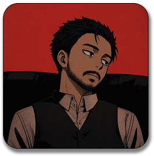

<!-- Header -->

  

  

<!-- Content -->
## ⇁ Knowledges

  <table style="border-collapse: collapse; text-align: center;">
    <tr><th colspan="5">Languages & Frameworks</th></tr>
    <tr align="center">
      <td></td>
      <td></td>
      <td></td>
      <td></td>
      <td></td>
    </tr>
    <tr align="center">
      <td></td>
      <td></td>
      <td></td>
      <td></td>
      <td></td>
    </tr>
    <tr><th colspan="5">Databases</th></tr>
    <tr align="center">
      <td></td>
      <td></td>
      <td></td>
      <td></td>
      <td></td>
    </tr>
    <tr><th colspan="5">IDE & Editors</th></tr>
    <tr align="center">
      <td></td>
      <td></td>
      <td></td>
      <td></td>
      <td></td>
    </tr>
    <tr><th colspan="5">OS</th></tr>
    <tr align="center">
      <td></td>
      <td></td>
      <td></td>
      <td></td>
      <td></td>
    </tr>
  </table>

   
  <small>I use Arch, btw!</small>

## ⇁ Education

Career and Technical Education (CTE) High School — ETERJ \
(Desktop & Web Development · Database Management · Computer Networks · 2020-2023)

BSC Software Engineering — Estácio de Sá \
(Distributed Systems · Cloud Computing · Security · In progress)

<!-- Footer -->
---

> © 2026 Cainã Carmo

  

