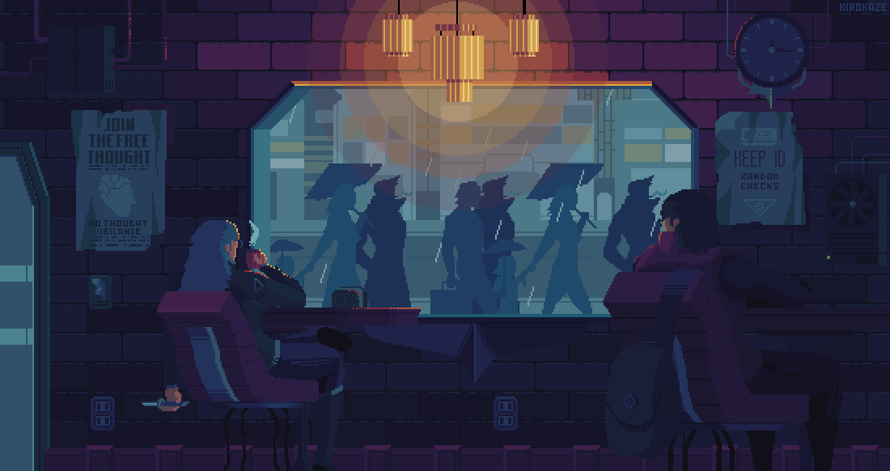

[//]: Header

![Header Bar][header_wave]
![Presentation Typing][perfil_text]

> I'm a Software Engineering student with a focus on backend development. I'm dedicated to continuous learning and improving my skills to create robust, efficient, and secure code. Here, you'll find projects and studies that reflect my journey in tech and my passion for building impactful solutions.

[//]: Content

## 💻 Knowledges

| Stack          | Icon                      |
| :------------- | :------------------------ |
| IDEs           | ![][icon-ide]             |
| Languages      | ![][icon-languages]       |
| Framework/Libs | ![][icon-frameworks-libs] |
| Database       | ![][icon-database]        |
| Tools          | ![][icon-tools]           |

## 📥 Contact

[![Linkedin Badge][badge-linkedin]](https://www.linkedin.com/in/caincarmo/)
[![Discord Badge][badge-discord]](https://discord.com/channels/@me/479399082037739521)

---

[//]: Footer

> © 2024 Cainã Carmo

![Footer Bar][footer_wave]

[//]: Links
[header_wave]: https://capsule-render.vercel.app/api?type=waving&height=200&color=ca9ee6&reversal=true&section=header
[footer_wave]: https://capsule-render.vercel.app/api?type=waving&height=100&color=ca9ee6&reversal=true&section=footer
[perfil_text]: https://readme-typing-svg.herokuapp.com/?color=cad3f5&size=35&center=true&vCenter=true&width=840&lines=Hello!%20👋%20Welcome%20to%20my%20profile!;Olá!%20👋%20Seja%20bem-vindo%20ao%20meu%20perfil!
[icon-ide]: https://skillicons.dev/icons?i=visualstudio,vscode,neovim,gamemakerstudio&perline=3
[icon-languages]: https://skillicons.dev/icons?i=html,css,js,ts,cs,php,lua,bash,powershell&perline=3
[icon-frameworks-libs]: https://skillicons.dev/icons?i=dotnet,nodejs,express,discordjs,prisma&perline=3
[icon-database]: https://skillicons.dev/icons?i=mysql,mongodb,sqlite&perline=3
[icon-tools]: https://skillicons.dev/icons?i=git,github,gitlab,npm,docker,obsidian&perline=3
[badge-linkedin]: https://img.shields.io/badge/LINKEDIN-0E76A8?style=for-the-badge&logo=linkedin&logoColor=cad3f5
[badge-discord]: https://img.shields.io/badge/DISCORD-5865F2?style=for-the-badge&logo=discord&logoColor=cad3f5
